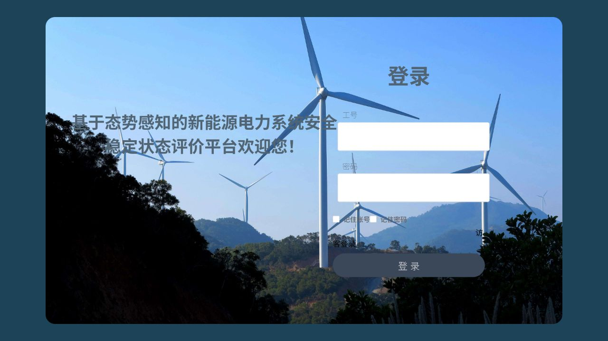
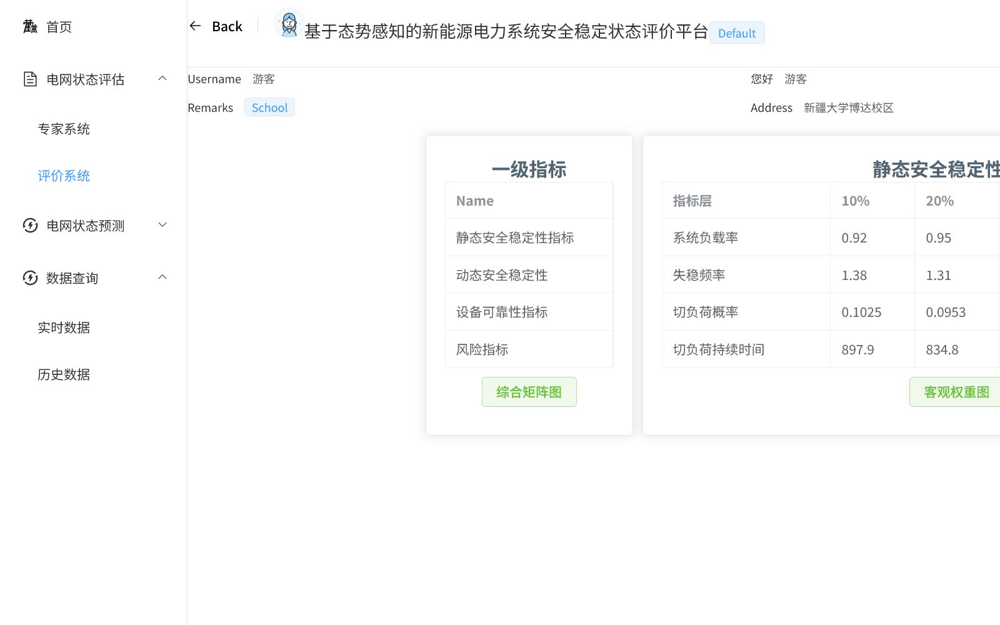
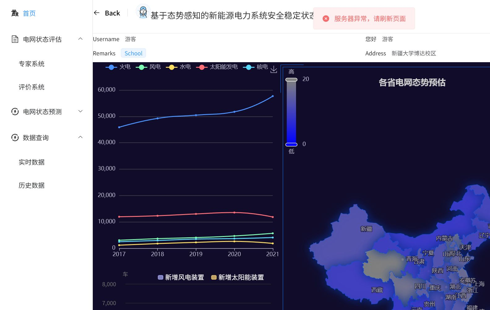

# Portfolio for GitHub

本仓库是我在真实项目中的核心实践集合，围绕“有交付结果 + 可复用设计 + 真实业务约束”来组织。两类对外可展示项目如下：

## 1) 電力データ評価プラットフォーム（Vue）
**仓库**：`https://github.com/domekisuzi/electrition-vue`

### 1-1. 项目背景（Background）
- 面向新能源研究场景的单页应用，核心需求是把复杂电网指标转化为可读、可操作的页面。
- 作为外部委托项目，核心目标是让非技术背景的使用者也能快速理解输入数据与风险结论。

### 1-2. 我负责什么（Task）
- 负责前端页面开发与交互实现（Vue 生态内）
- 参与需求澄清：与客户面对面沟通后补全页面行为边界（按钮动作、字段权限、数据分组）
- 参与数据结构落地：将业务规则映射为可维护的前端状态与展示模型

### 1-3. 解决方案（Action）
- 使用 `Vue Router + Pinia + Element Plus + Axios` 建立基础骨架。
- 在不改变业务本质的前提下，把复杂参数通过统一组件抽象降低理解成本。
- 针对风险评估页和可视化页，先做指标归类，再做展示策略，避免“页面先做、逻辑后补”。

### 1-4. 结果（Result）
- 完成了从登录、数据查询、风险评估、可视化展示到账号管理的一整套闭环。
- 将一套可复用的数据查询与展示方式沉淀为项目内可持续迭代结构。
- 形成了较稳定的“先定义指标边界，再设计交互细则”的开发节奏。

### 1-5. 亮点（Selling Point）
- 有真实用户沟通痕迹：在开发前先确认字段含义和操作预期。
- 关注信息架构：把复杂数据按“可理解层级”拆解。
- 重视展示可读性：使用图表替代纯表格，降低用户认知负担。

**截图**

---

## 2) Suzi Blog（React + Spring Boot）
**仓库**：`https://github.com/domekisuzi/suzi-blog`

### 2-1. 项目背景（Background）
- 最初用于个人学习与任务管理，后期不断演进为“模块 - 任务 - 子任务 - 目标”四层任务系统。
- 真实使用场景是日常学习、训练、目标管理一体化；业务结构从“一个列表”升级为“多模块协同”。

### 2-2. 我负责什么（Task）
- 负责前后端主干开发与结构性重构（React/TypeScript + Spring Boot）
- 负责数据库与接口联调策略，使数据备份、导入导出、跨模块聚合可以落地
- 负责页面迭代：模块看板、任务管理、时间线目标面板、数据恢复入口

### 2-3. 解决方案（Action）
- 把业务拆成四段：
  1. 数据模型分层（模块/任务/子任务/目标）
  2. 页面分层（模块面板 → 任务列表 → 详情与状态）
  3. 操作边界（新增、更新、删除、恢复）
  4. 可用性保障（导入导出、加载反馈、状态反馈）
- 在功能增长后期，避免“大脑模型过载”，采用小范围验证 + 分批发布。

### 2-4. 结果（Result）
- 支持了从零散记录到结构化目标追踪的完整闭环。
- 增加了备份导入导出能力，增强了数据可恢复性。
- 通过持续迭代提升了页面可维护性与信息组织效率。

### 2-5. 亮点（Selling Point）
- 全栈连续交付：从前端界面到后端接口到数据库层有完整思路闭环。
- 复杂需求拆解能力：用模块化思路应对功能扩展。
- 工程化思维：功能增长后期优先控制边界，保证稳定性。

**截图**

---

## 使用方式（给面试官一眼看的摘要）
- 我不只写功能，还会先做业务拆解，再落工程实现。
- 我不只“写代码”，更关注需求边界、信息结构和可交付一致性。
- 两个公开项目都包含从需求澄清、页面实现到上线反馈的闭环过程。
