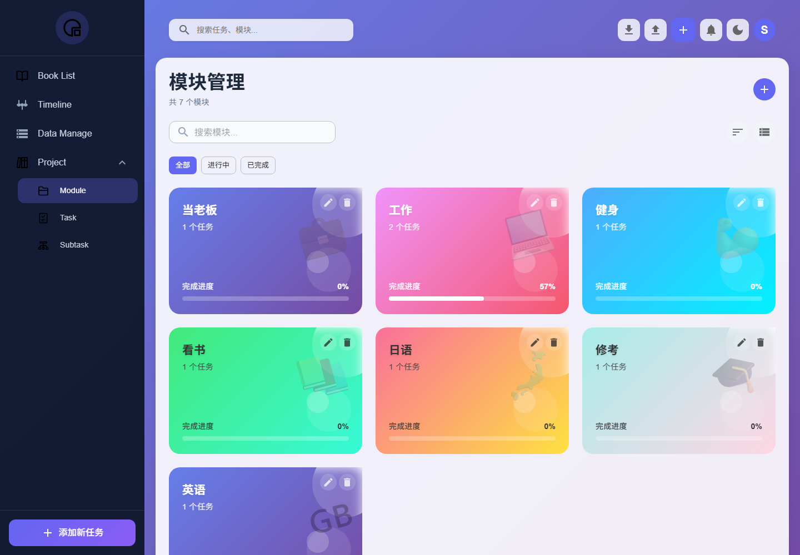
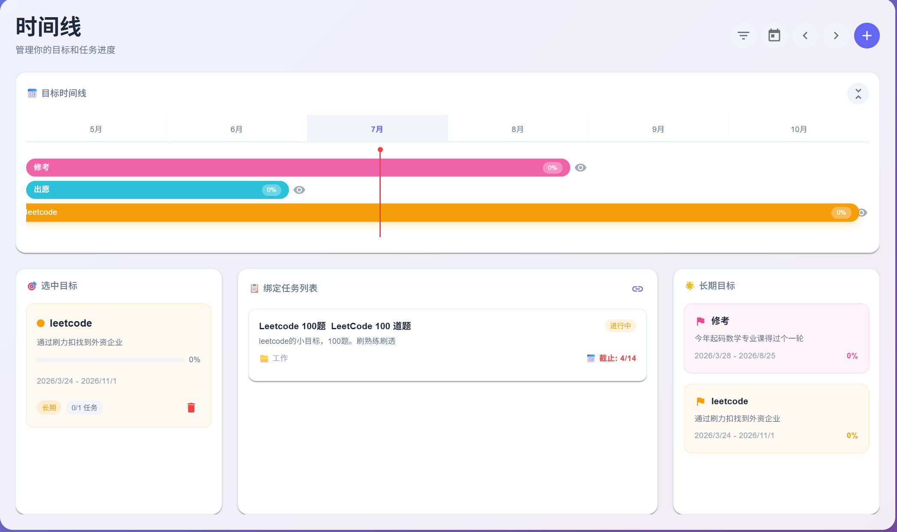
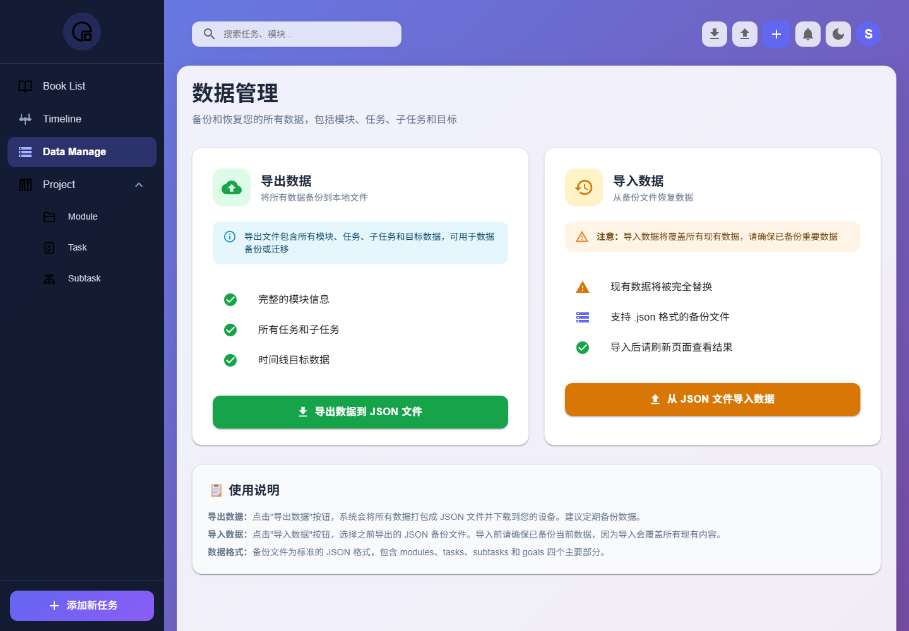

# Suzi Blog — タスク管理・目標追跡システム

**期間**: 2025.04 – 2026.03  
**GitHub**: https://github.com/domekisuzi/suzi-blog  

## 1. 背景（Background）

当初は「日々のタスク管理」用途の個人向けツールとして着手しました。  
運用を続ける中で、学習・業務・読書・英語学習といった性質の異なる行動を1つの画面で管理しにくくなり、  
「短期タスク」と「中長期目標」を同時に見渡せる設計が必要になりました。

## 2. 課題理解（Question）

1. 情報量が増えると、タスクの優先順位がわからなくなる。  
2. 目標と実行タスクの関係が切れ、実行していても進捗が見えにくい。  
3. JSONによるバックアップがないため、データ喪失時の再開コストが高い。  
4. APIエラー時の状態可視性が弱く、ユーザーが「保存できたか」を把握しづらい。

## 3. 施策（Action）

- 情報設計を「モジュール → タスク → サブタスク → 目標」の4層に再整理。
- React + TypeScript + Material UIでモジュール管理、タスク管理、目標タイムラインを分割実装。
- Spring Boot + MySQLで後段APIを整備し、タスク・目標・サブタスクの関連をAPI契約で保持。
- 共通の `Loading` / `Notification` / APIハンドリングを整備して、操作フィードバックを標準化。
- JSON形式のエクスポート/インポートを実装し、データ復元導線を確保。

## 4. 成果（Result）

- 62回の反復コミットで、機能拡張とUI改善を継続実装。
- モジュール別・期限別の把握を1画面で実現し、実行に優先度がつく構造を構築。
- タイムライン上で短期/中長期目標の整合性を確認できるため、行動計画の意思決定が速くなった。
- エクスポート/インポートにより、データ復元と運用継続性を確保。

## 5. 使った技術（Technical）

| 種別 | 技術 |
| --- | --- |
| フロント | React, TypeScript, Material UI |
| ルーティング | React Router |
| 状態管理 | React Hooks, Context |
| API連携 | Axios, API Adapter |
| バックエンド | Spring Boot 3, Java 17, Spring Data JPA |
| DB | MySQL |
| バージョン管理 | Git |

## 6. 主な画面

## 7. ONE-TO-ONEサマリー（面接向け）

実装だけでなく、要件整理 → 情報設計 → 画面構成 → API連携 → 利用継続の運用設計までを通して、  
業務の変化に追従する実装サイクルを回してきました。
